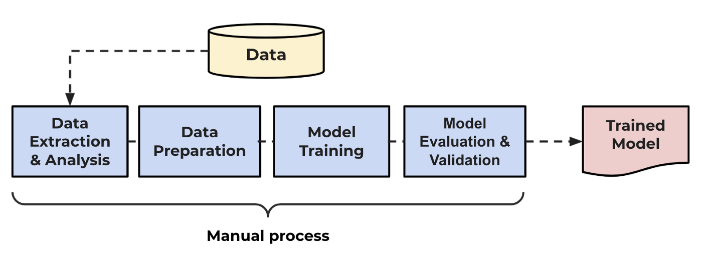
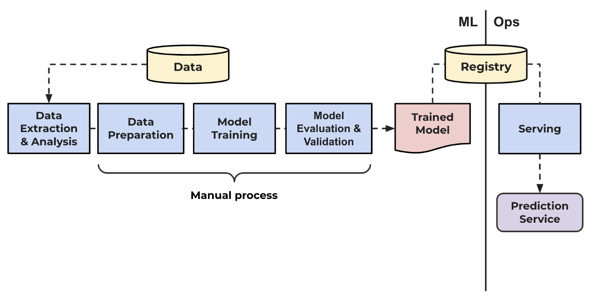
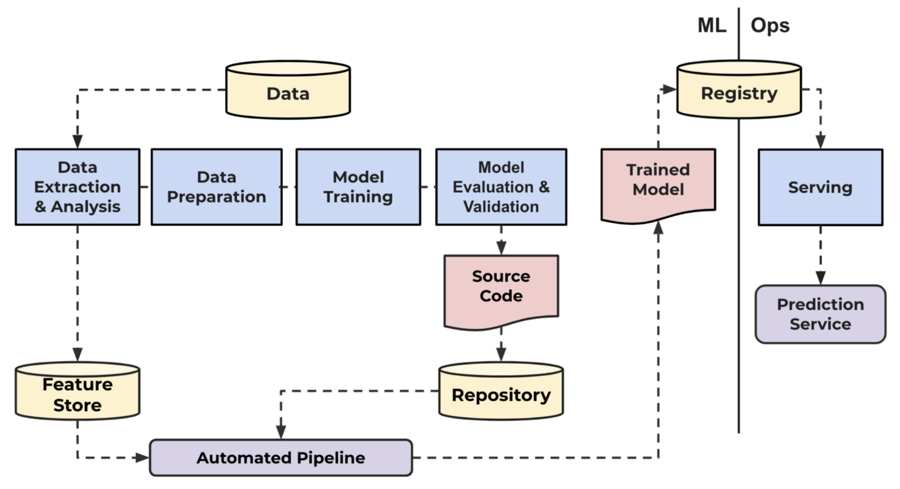
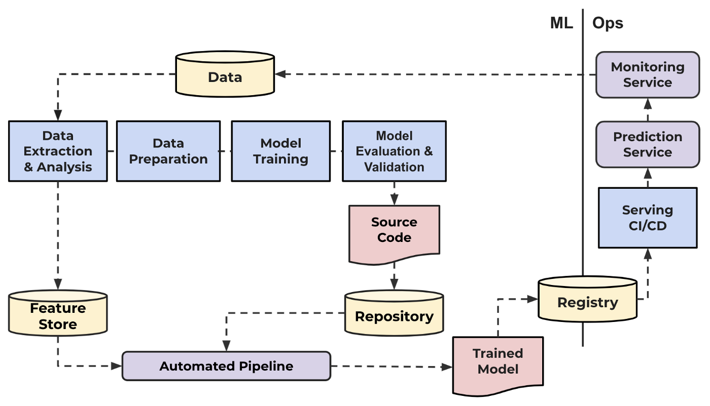
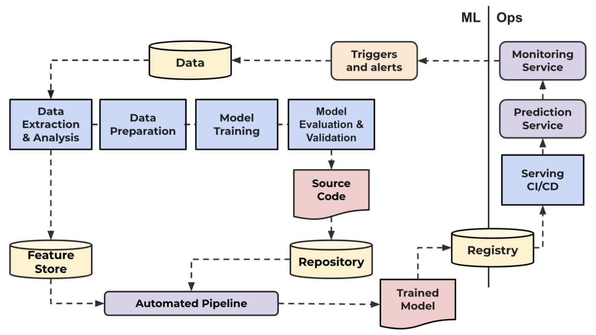

# MLOps Maturity Model

From No-MLOps to Full Automation.

Other moving parts around “ML Code” with different levels of complexity and usability like having the proper infrastructure, a good monitoring platform, code version control, feature engineering and a feature store, reproducibility, to mention a few examples, all asses the level of maturity in building and successfully deploying ML models.

## Level 0: No MLOps

**Description**
- All code in jupyter notebooks.
- Everything is done manually (data gathering, data preparation, training, testing, building, deploying).
- Little to no feedback and monitoring post-deployment.
- Data scientists work isolated and alone and deliver notebooks.

**Ideal for**:
- POC (just want to experiment).

## Level 1: DevOps no MLOps

**Description**
- Some level of automation.
- Data pipeline gathering the data.
- Releases are automated.
- Unit tests and integration tests.
- CI/CD
- Ops metrics (resources but not ML-awared)
    - Network
    - Memory usage
    - GPU usage
- No experiment tracking
- No reproducibility
- DS separated from engineers.

**Ideal for**:
- POC transition to production environment.

## Level 2: Automated training

**Description**
- Data pipeline gathering the data.
- Training pipeline (could be a script)
- Experiment tracking
- Model registry (models are version controlled).
- Low friction deployment.
- DS works with engineers.

**Ideal for**:
- Multiple use cases/models (2-3) in your company.

## Level 3: Automated deployment

**Description**
- No human intervention to deploy model.
- A/B testing to choose best model on production (redirect all traffic to best one).
- Automated retraining.

**Ideal for**:
- Mature and multiple cases/models (+3)

## Level 4: Full MLOps

**Description**
- Automated training.
- Automated retraining (monitring and triggering).
- Automated deployment.

**Ideal for**:
- Certain about model performance.
- Higher confidence on the process.

Not everything needs to be in Level 4, actually, this level of maturity is very specific for certain models.

## References:

- MLOps Maturity Model - Microsoft: https://docs.microsoft.com/en-us/azure/architecture/example-scenario/mlops/mlops-maturity-model
- The role of MLOps on effective AI: https://engineering.rappi.com/the-role-of-mlops-on-effective-ai-dda75d638805
